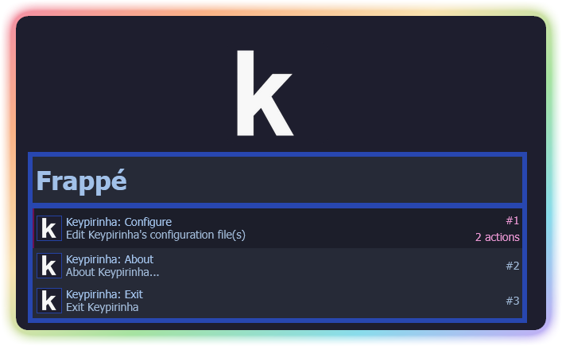
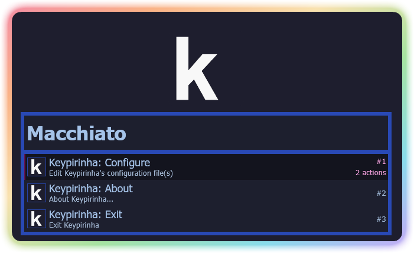
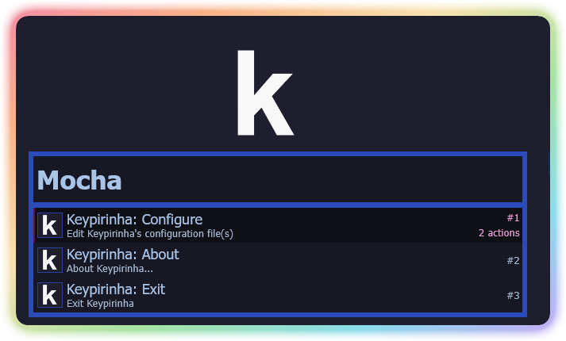

<h3 align="center">
	<br/>
	
	Catppuccin for <a href="https://discord.com/">Discord</a>
	
</h3>

<p align="center">
    <a href="https://github.com/Lumi2Ex/Keypirinha-Catppuccin-Port/stargazers"></a>
    <a href="https://github.com/Lumi2Ex/Keypirinha-Catppuccin-Port/issues"></a>
    <a href="https://github.com/Lumi2Ex/Keypirinha-Catppuccin-Port/contributors"></a>
</p>

<div align="center">

</div>

## Previews

<details>
<summary>🌻 Latte</summary>

</details>
<details>
<summary>🪴 Frappé</summary>

</details>
<details>
<summary>🌺 Macchiato</summary>

</details>
<details>
<summary>🌿 Mocha</summary>

</details>

## Requirement :
Download [Keypirinha](https://keypirinha.com/)

## Usage
1 - Download (or copy content) your preferred flavor text file (4 size available from Jumbo (preview) to Tiny)<br>
2 - Right click Keypirinha tray icon and click configure keypirinha<br>
3 - Copy / Paste the txt file content into the right configuration panel<br>
4 - At the top of the same configuration panel copy paste this :<br>
```
[gui]
theme = YourThemeName
```
5 - Ctrl + S (Or save) And quit<br>
6 - Done !

## 💝 Thanks to
  - [@Furhmann](https://github.com/Fuhrmann) awesome [Theme builder for Keypirinha](https://fuhrmann.github.io/keypirinha-theme-builder/)

&nbsp;

<p align="center"></p>
<p align="center">Copyright &copy; 2021-present <a href="https://github.com/catppuccin" target="_blank">Catppuccin Org</a>
<p align="center"><a href="https://github.com/catppuccin/catppuccin/blob/main/LICENSE"></a></p>
